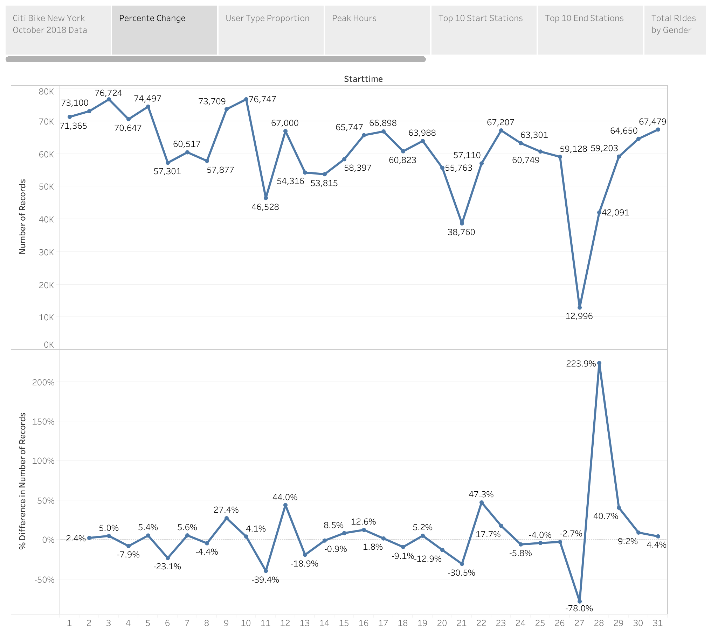

# Tableau Story - Citi Bike Analytics

## Description
Built a Tableau story with several data visualizations to explore the [New York Citi Bike Dataset]((https://en.wikipedia.org/wiki/Citi_Bike)).

## Tools Used
**Excel, Tableau**

## Finished Result

[Tableau Public Link](https://public.tableau.com/views/CitiBikeNYOctober2018/CitiBikeNYOctober2018Story?:retry=yes&:embed=y&:display_count=yes)